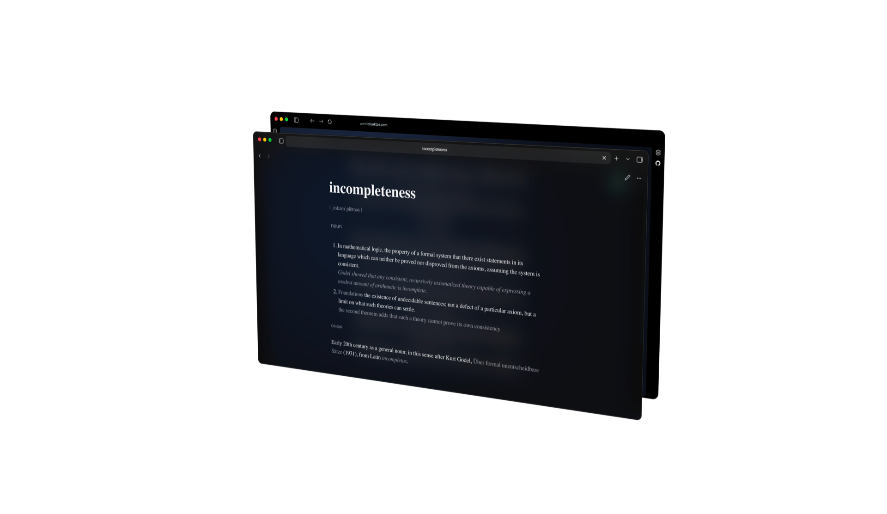

# Dictionary Look

Dictionary-style typography for Obsidian. Dark theme. HUD glass is macOS only.

## Install

Unzip the [latest release](https://github.com/btuaktpe/dictionary-look/releases/latest) into `.obsidian/plugins/dictionary-look/`, reload, and enable the plugin.

## Markup

- `#` headword
- `##` homograph
- `> | … |` pronunciation
- `==noun==` label
- `####` origin
- `*text*` muted
- `_text_` example

MIT
